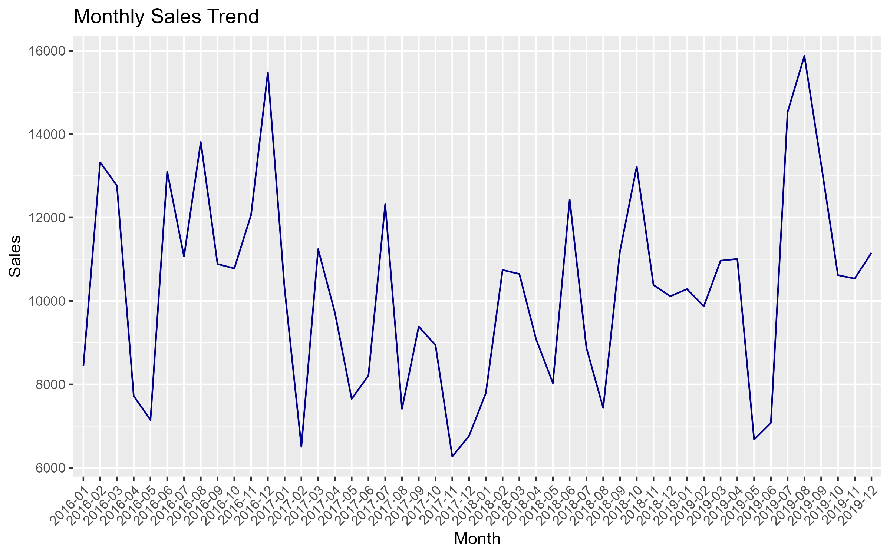
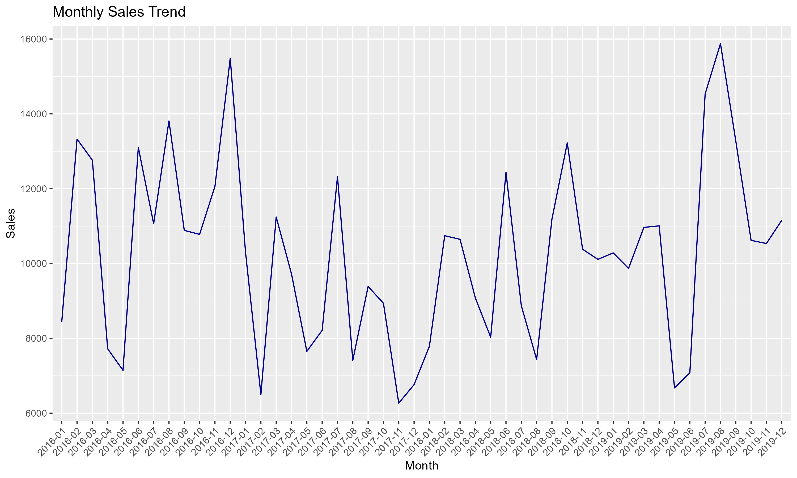

# Superstore Sales Analysis

This project explores a fictional Superstore’s sales and profit data using R. It includes data cleaning, time series analysis, and visualizations using ggplot2.

## 🚀 Features
- Monthly sales trends
- Profit by product category
- Cleaned and converted date columns
- ggplot2-based charts

## 📦 Tools Used
- R, RStudio
- dplyr, readr, ggplot2
- Git + GitHub

## 📁 Files
- `superstore_expanded.csv` – dataset (1,000 rows)
- `superstore_analysis.R` – main script
- `README.md` – project summary

## 📈 Daily Sales Plot

## 📊 Monthly Sales Trend
